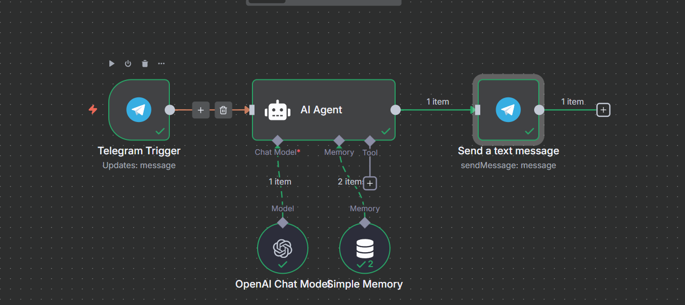

# AI Product Price Comparison Telegram Bot

This project is an AI-powered Telegram bot that helps users compare product prices across multiple Indian e-commerce platforms like Amazon, Flipkart, and Zepto. Built with n8n, LangChain, and GPT-4o, the workflow receives product queries via Telegram, scrapes product details from various links, and replies with a neatly formatted, clickable price comparison directly in the chat.

 
## Features

- Accepts product search requests on Telegram.
- Scrapes product names, prices, and stock info from Amazon, Flipkart, Zepto, and more.
- Highlights the lowest price and stock status automatically.
- Uses OpenAI GPT for natural language processing.
- Returns results in a Telegram-optimized, Markdown format.

## Usage

1. Clone the repository and import the n8n workflow (`My-workflow-5.json`).
2. Set up Telegram bot API credentials in n8n.
3. Configure OpenAI API and any retailer link sources.
4. Deploy the workflow and interact with the bot on Telegram.

## Requirements

- n8n (self-hosted or cloud)
- Node.js
- Telegram bot credentials
- OpenAI API key (for GPT-4o)
- Retailer product link sources

## License

MIT License (see LICENSE for details)

---

Made with ❤️ using n8n, LangChain, and OpenAI.
